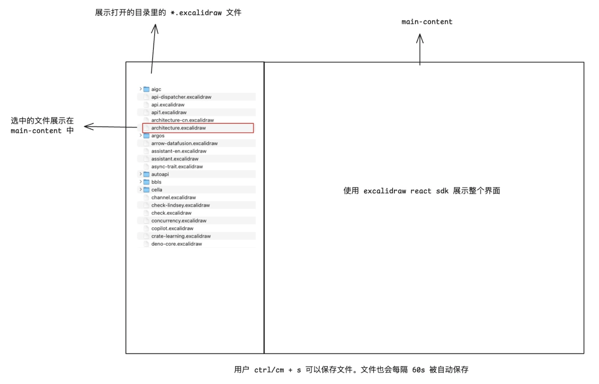

# 基本想法
这个App呢主要就是可以把Excalidraw的文件导入进来，然后进行编辑。它的UI是长这样的就是一个侧边栏然后在APP打开的时候可以去指定一个目录然后目录下面的文件就会被读到侧边栏里面如果说之前已经打开过某个目录的话那么就直接展示上一次打开的目录然后当用户点击某个侧边栏上面的ExcelDraw文件的时候就会在 主的屏幕里面去显示ExcelDraw的图表然后这个是使用ExcelDraw的SDK来完成 然后如果用户在侧边栏切换文件的话那么会显示新的文件旧的文件如果是被修改过的话会自动保存，见设计稿：
